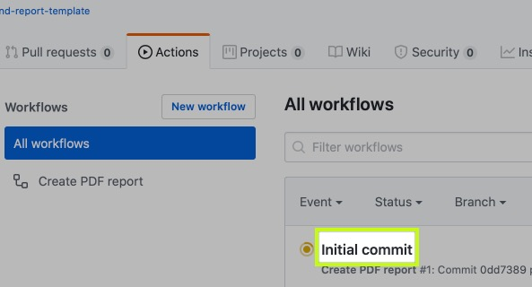
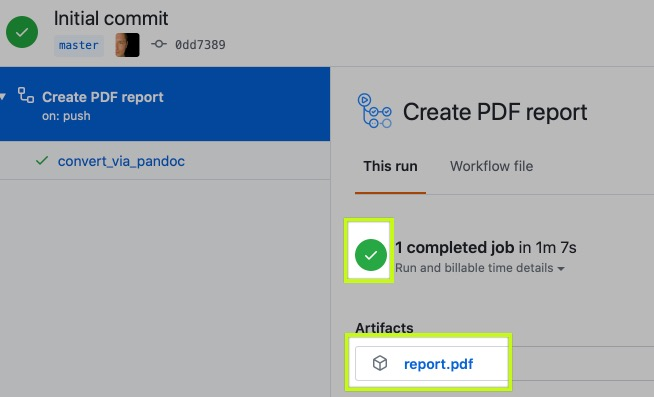
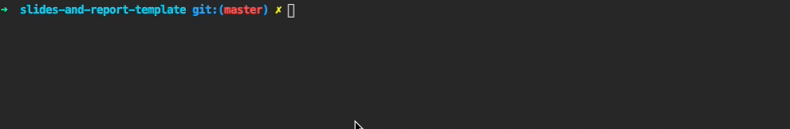
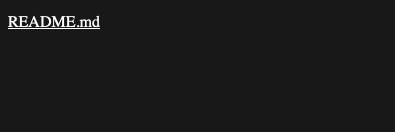
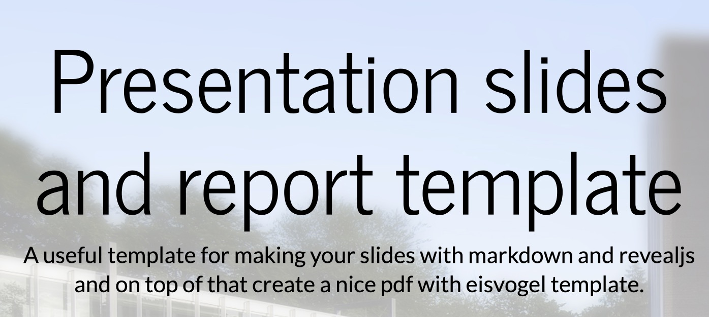
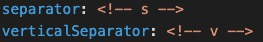

# Presentation slides and report template
<!-- .slide: data-background="images/slides-headline-background.jpg" -->

A useful template for making your slides with markdown and revealjs and on top of that create a nice pdf with eisvogel template.

<!-- s -->

## Why?

- normal presentations are boring<!-- .element: class="fragment" -->
- still differences in the platforms even in MS power point, e.g. Windows, Mac or Linux.<!-- .element: class="fragment" -->
- Usually you multiple sources and multiple output documents so not only slides but maybe also papers you would like to provide for the students.<!-- .element: class="fragment" -->
- These papers are currently in pdf form delivered to the students, and can also be simple pdfs of the slides.<!-- .element: class="fragment" -->
- Solution wanted having one single source and decide what to have in the slides and maybe also additional and more detaillled information in a paper as pdf, docx or webpage.<!-- .element: class="fragment" -->

<!-- s -->

## Current solution

- [The HTML presentation framework | reveal.js](https://revealjs.com/) presentations.
- is still tech based (HTML)
- Now based on Markdown, as simple language
- Simple to write and support for transforming it into other document types, e.g. with pandoc is pretty good.

<!-- s -->

## How to use this template

- Use this as **template** instead of cloning it, so you get rid of all the commits. Click on the template-button near to the cloning option 
  


- Now you can create an own repository based on this repository.

<!-- s -->

## Create a report

- Luckily, it will be done automatically by github actions (due to the [make-pdf.yml file](.github/workflows/make-pdf.yml)) of course
- If you now click on Actions tab and then on the first build 

 

<!-- s -->
- then click on the report.pdf file if the build is green 

 

- you will download a PDF which was generated from the README.md file. Nice! 
- How to adapt that see a later chapter. 
  
<!-- s -->  


## Create a presentation

- Now I want a presentation from the same content.
- Prerequisite is having docker installed on your machine.
  - [Get Docker | Docker Documentation](https://docs.docker.com/get-docker/)
- With docker running, first **clone** your repository to your local machine. 

<!-- s -->

- Go into the directory and do the following in a Terminal/Command line: 

```bash
docker run --rm -p 1948:1948 -v `pwd`:/slides webpronl/reveal-md:latest
```



<!-- s -->

- Now open `http://localhost1948`in your browser.
- click on the README.md link: 

- HTML Presentation starts!



<!-- v -->

## Further information

### Adapt presentation data

- So you should of course change all the text here in the README.md file and put your own (course) content in here. 
  
<!-- v -->

#### Adapt title, subtitle and more

- to change it you have to change the parameters in the beginning of the document, here a snippet:


<!-- v -->

```json
...
title: "Presentation slides and report template"
subtitle: "How to make slides and a report with markdown from one source"
author: [Stefan Sobek]
date: "2020-06-10"

...

```

<!-- v -->

- The first options belong to the report, such as title and subtitle. 
- Starting from `# reveal settings` the settings for revealjs begin
- As the pdf report settings are quite self explaining, I will provide some infos for how to change some specific things in the presentation.

<!-- v -->

- theme:
  - choose one theme from the provided presenation themes: # simple black white league beige sky night serif simple solarized blood moon 
- e.g. `theme: simple`

<!-- v -->



- **separator:** Defines a separator for horizontal slides. Look into this README.md file how this works. If you put this comment into the markdown text, the report will ignore it and revealjs will create a slide page. So you have to define what should be on your slides. 

  
<!-- v -->


- **verticalSeparator:** Defines a vertical separator, means that if you put this in the markdown text, then a vertical slide will be created. This means you can navigate with arrow-down on the keyboard to this slide. 
- **HINT** I use this a lot for **hiding** information in slides or provide backup slides or just **hide** stuff in slide so that it is only in the PDF report. Advantage: get the details out of the presentation but still have it available if necessary. Look it up in this README.md code. E.g. this part is also not horizontally visible, thus available on the last slide by going **down**
 
<!-- v -->

- `transition: 'slide'` - set the transition from slide to slide to None - Fade - Slide - Convex - Concave - Zoom 
- `parallaxBackgroundImage: 'images/fontys-parallax-all.jpg'` - nice feature of having a parallax background image, means it moves when going from slide to slide. 
- `autoSlide: 4000` - have your presentation run automatically, 4000 means 4 seconds

### More information and links

- [webpro/reveal-md: reveal.js on steroids! Get beautiful reveal.js presentations from any Markdown file](https://github.com/webpro/reveal-md)
- [The HTML presentation framework | reveal.js](https://revealjs.com/)
- [Präsentationen mit Markdown, reveal.js und Github Pages: mein neuer Workflow – Lost and Found (GERMAN)](https://wittenbrink.net/lostandfound/praesentationen-mit-markdown-reveal-js-und-github-pages-mein-neuer-workflow/)