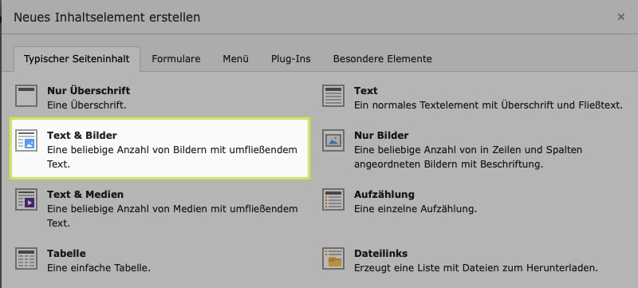

# Rhenania Hinsbeck Webseiten - Anleitung für Redakteure
<!-- .slide: data-background="images/rhenania-hinsbeck-vektor-opacity.svg" -->
Anleitung für Trainer und Offizielle für die Webseitenpflege in Typo3

<!-- s -->

## Rhenania Hinsbeck Webseiten - Typo3

- Dieses Dokument ist eine Anleitung für Trainer und Offizielle.
- Trainer sollen mit Hilfe dieser Anleitung in der Lage sein, sich in Typo3 - das Content Management System für die Webseiten [www.rhenaniahinsbeck.de](https://www.rhenaniahinsbeck.de) einzuloggen, und Fotos und Berichte ihrer Mannschaft zu veröffentlichen

<!-- s -->

## Einloggen auf www.rhenaniahinsbeck.de

- Einen Internetbrowser auf dem PC öffnen und [www.rhenaniahinsbeck.de](https://www.rhenaniahinsbeck.de/typo3/) eingeben

- Hier **Benutzername** und **Passwort** eintragen und auf **Login** drücken

- Falls ihr Trainer seid und über noch keine Login Daten verfügt, bitte wendet euch an Jürgen Cleven. 
- Sobald ihr erfolgreich eingeloggt seid, bekommt ihr eine Übersicht über die Seiten, die ihr Bearbeiten könnt. 
  

## Einen neuen Spielbericht anlegen

Für das Anlegen eines neuen Spielberichtes muss zuerst eine neue Seite angelegt werden.

### Neue Seite anlegen

- Ggf. Seitenbaum ausklappen damit alle weiteren Seiten angezeigt werden

- Dort auf den ersten Eintrag klicken, wo man auch eine neue Seite (also Bericht) anlegen möchte

- Jetzt erscheint ein Menu, dort auf **neu** klicken

- Den Titel und den Untertitel ausfüllen, weshalb Untertitel, sehen wir später

- Mit dem Untertitel, wird auf der Seite der Untertiteltext bestimmt, siehe:

- Habt ihr Titel und Untertitel ausgefüllt, speichern!

- Jetzt ist die Seite schon verfügbar, allerdings noch ohne Inhalt, außer Titel und Untertitel.

### Inhalt der neuen Seite anlegen

Natürlich sollen auch Bilder und Text auf diese Seite. 

- Im Seitenbaum auf der linken Seite auf die gerade neu erstellt Seite mittig klicken

- Auf **+ Inhalt** klicken

- **Text & Bilder** auswählen

- Auf der folgenden Seite 
  - Auf dem Reiter **Allgemein**
  - Die **Überschrift** eintragen
  - Das **Datum** eintragen
  - Unter **Text** den Spielbericht/Turnierbericht/Sonstiges eintragen

- Um Bilder hinzuzufügen im Reiter auf **Bilder** klicken
- Auf Bild hinzufügen klicken um Bilder hochzuladen und auszuwählen. 
- Dazu erst auf **Choose Files**
- Dann nach dem Hochladen auf das **+** Symbol nebem dem gewünschtem Bild klicken. 
- Hilfreich ist auch **Vorschaubilder anzeigen**
- Bei **Position und Ausrichtung** bietet sich **Im Text rechts** an, Wahl ist aber frei, gerne selbst Wählen.
- Anzahl Spalten bietet sich 1 oder 2 an, aber auch hier, je nach Gusto wählen, ggf. später ändern falls nicht gefällt.
- Zum Schluss wieder Speichern wie oben beschrieben.

- Jetzt ist die Seite veröffentlicht. 
- Um das Ergebnis anzuschauen entweder auf [www.rhenaniahinsbeck.de]](https://www.rhenaniahinsbeck.de/) gehen und bis zur Seite klicken oder einfacher:
- auf das Dateisymbol klicken

- **Ansehen** auswählen

- Ergebnis sieht so aus:

